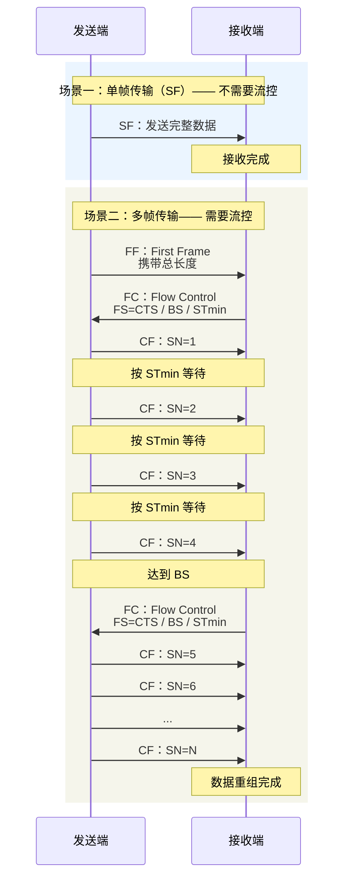

标准名称通常是 **ISO 15765-2（ISO-TP）**，汽车诊断 UDS 中大量使用。
Linux ，Zephyr 已经先天支持。

# 核心帧类型 

- SF：Single Frame 单帧 
- FF：First Frame  首帧
- CF：Consecutive Frame 连续帧
- FC：Flow Control 流控帧

## 格式

```
CAN ID
  │
  ▼
┌──────┬─────────────────────────────────────┐
│  ID  │              CAN Data               │
└──────┴─────────────────────────────────────┘
             │
             ▼

       CAN Data
	┌──────────────┬──────────────────────────────┐
	│     PCI      │           Payload            │
	│    1 Byte    │                              │
	└──────────────┴──────────────────────────────┘
      │
      ▼
	┌──────────┬──────────┐
	│ 高4 bit  │ 低4 bit  │
	│ 帧类型    │ 类型相关  │
	└──────────┴──────────┘
       
       
```

| 高4 bit | 帧类型 | 低4 bit          |
| ------ | --- | --------------- |
| `0`    | SF  | SF数据长度          |
| `1`    | FF  | FF长度的一部分        |
| `2`    | CF  | Sequence Number |
| `3`    | FC  | Flow Status     |

## 发送时序


